# Secure Staff Onboarding and Managment System

This project is a secure, Java-based desktop application used for onboarding and managing staff records. The application allows for the creation, modification, and validation of staff profiles, job roles, training requirements, and secure login authentication. It includes the ability to view staff records for HR use and ensures security through hashed passwords.

### Built With

- Java
- SQL (MySQL with DBeaver)
- Maven
- JFrame (Swing)
- JUnit (for testing)

## Main Page Componets:

1. Login Page

   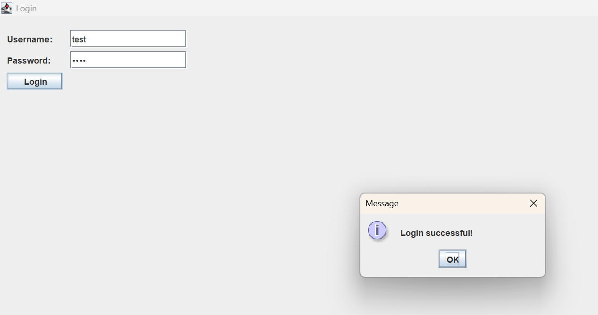
2. Home Page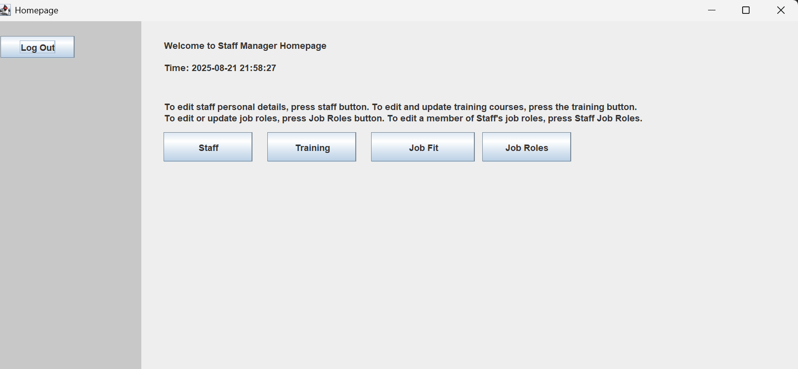
3. Staff Page 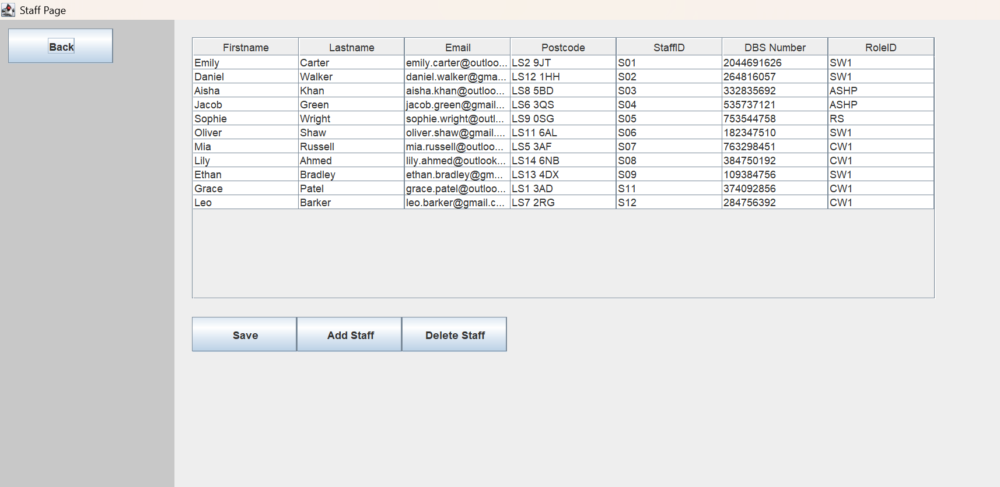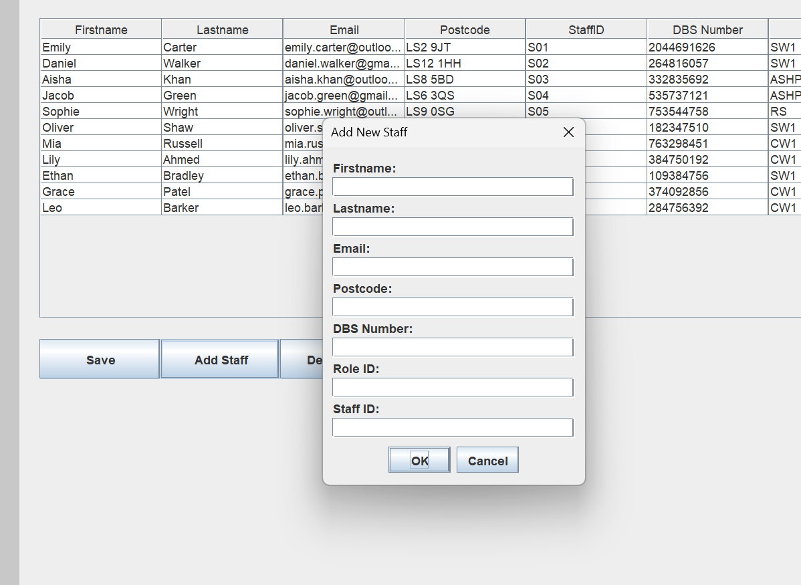
4. Training Page

   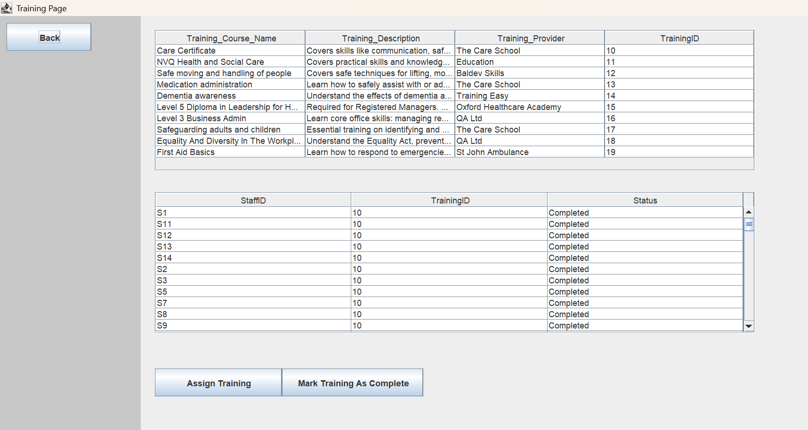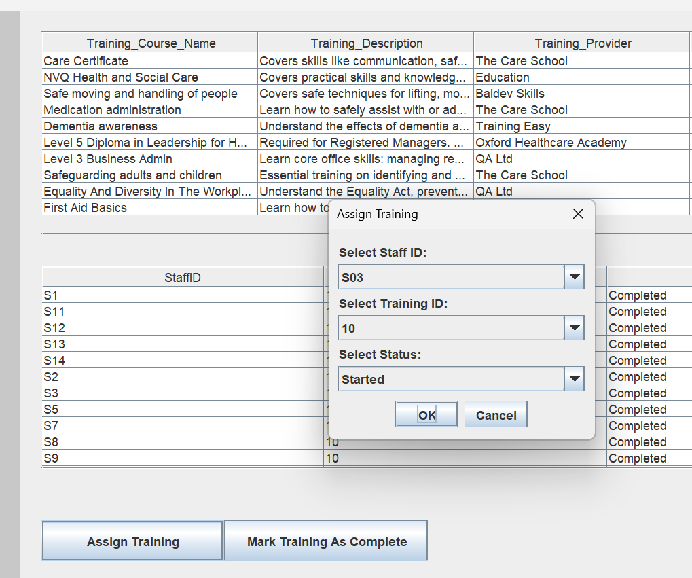
5. Job Fit Page

   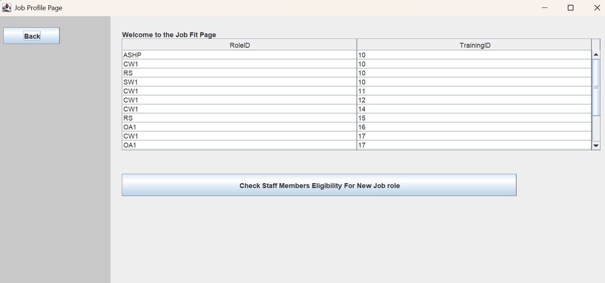

   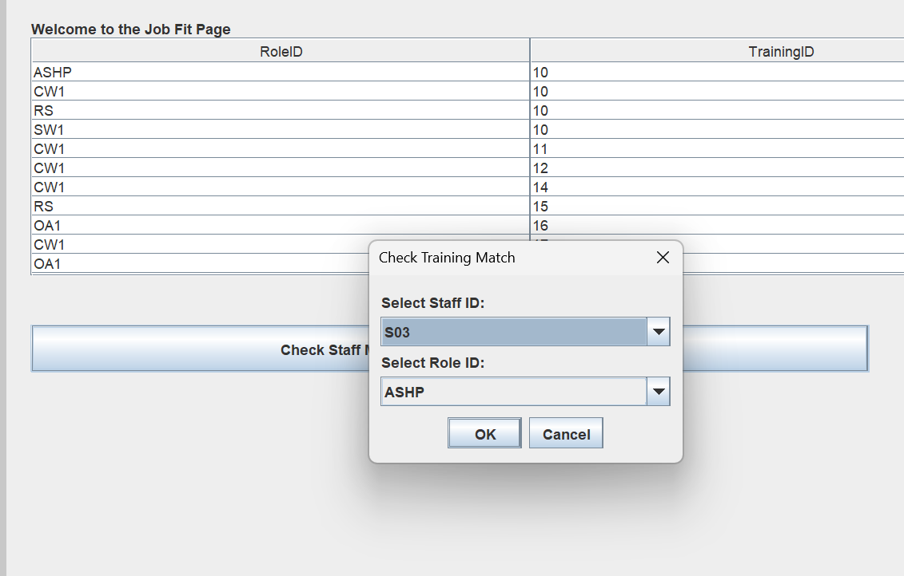

   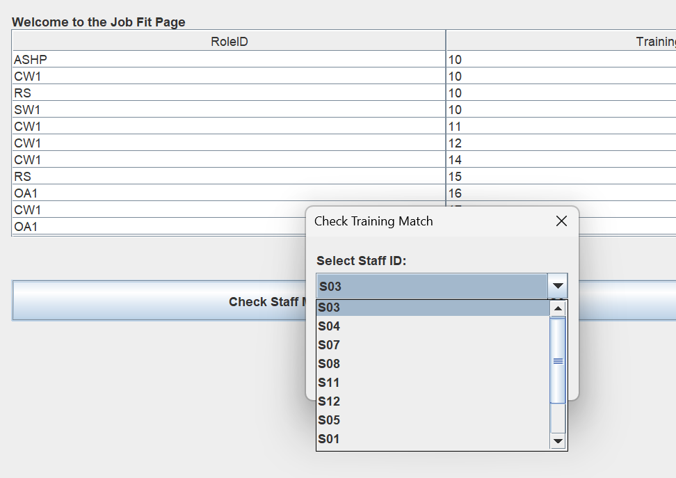
6. Job Role Page

   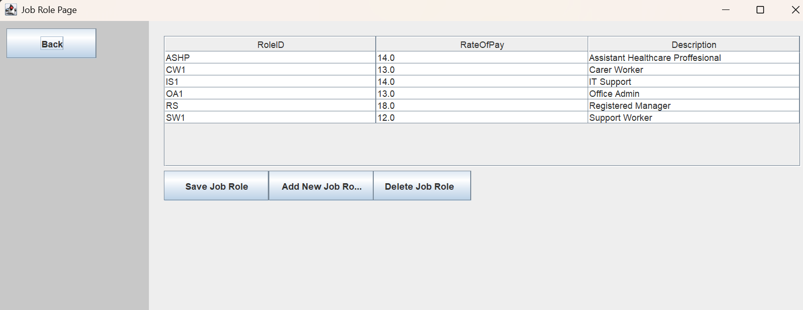

---

#### Project Structure:

**Main Folder**

* **DAO Package:** Contains classes responsible for accessing and manipulating data in the database.
* **Database Package:** Contains the `DatabaseConnector` class which sets up the connection with the **StaffOnboarding** database.
* **GUI Package:** Contains the GUI classes created with `JFrame`, which use methods from DAO classes and also use methods and logic from Service classes.
* **Service Package:** Contains the business logic classes that act as a bridge between the GUI and DAO. They validate inputs, apply rules, and coordinate data flow.
* **Model Package:** Contains model classes (POJOs) that represent entities such as staff or departments. These are used to transfer data between DAO, Service, and GUI layers.
* **Util Package:** Contains utility classes such as the `CSVLogger` class, which prints and updates logins to the CSV log file.
* **Logs Package:** Contains a CSV file which records login details, including attempts and timestamps.
* **Main Java Class:** The application entry point with the `main()` method, responsible for launching the program and initializing required services.

**Testing Folder**

* Includes unit tests corresponding to the main package modules

---

### DBeaver MySQL Staff Onboarding Database:

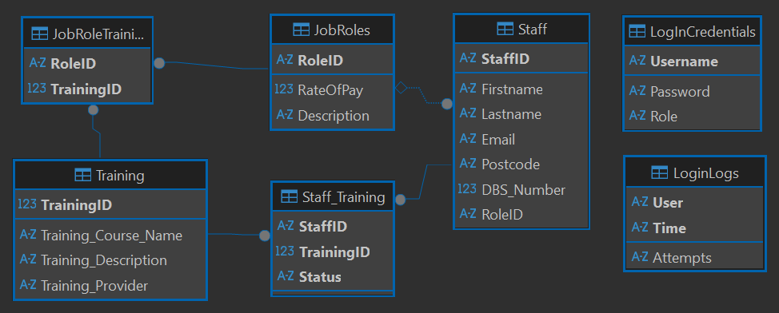

The schema consists of several main entities:

The primary keys are in bold on the diagram above, the lines connecting tables represent foreign keys.

* **Staff**: stores staff details and their assigned role.
  * Firstname varchar(100)
  * Lastname varchar(100)
  * Email varchar(100)
  * Postcode varchar(100)
  * StaffID varchar(100)
  * DBS Number Int
  * RoleID varchar(100)
* **Training**: holds available training courses.
  * Training_Course_Name varchar(255)
  * Training_Description varchar(255)
  * Training_Provider varchar(100)
  * TrainingID Int
* **Staff\_Training**: join table mapping which staff have completed which training and their status.
  * StaffID varchar(100)
  * TrainingID int
  * Status varchar(100)
* **JobRoles**: defines job roles and their requirements.
  * RoleID varchar(100)
  * RateOfPay double
  * Description varchar(100)
* **JobRoleTraining**: join table mapping which trainings are required for which roles.
  * RoleID varchar(100)
  * TrainingID int
* **LogInCredentials**: stores usernames, passwords, and roles for authentication.
  * Username varchar(100)
  * Password varchar(240)
  * Role varchar(100)
* **LoginLogs**: records login attempts with timestamps and outcomes.
  * User varchar(100)
  * Time varchar(100)
  * Attempts varchar(100)

## How to Use And Database Setup

This project uses a **MySQL database running on localhost**.

1. Install [MySQL](https://dev.mysql.com/downloads/) and [DBeaver](https://dbeaver.io/download/) (or any SQL client).
2. Create a database named `StaffOnboarding` on your local MySQL server.
3. Import the provided schema (see screenshot below for reference).
4. Update the database credentials in `DatabaseConnector.java` to match your local setup:

   ```java
   private static final String URL = "jdbc:mysql://localhost:3306/StaffOnboarding";
   private static final String USER = "your-username";
   private static final String PASSWORD = "your-password";
   ```
